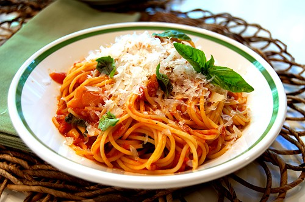
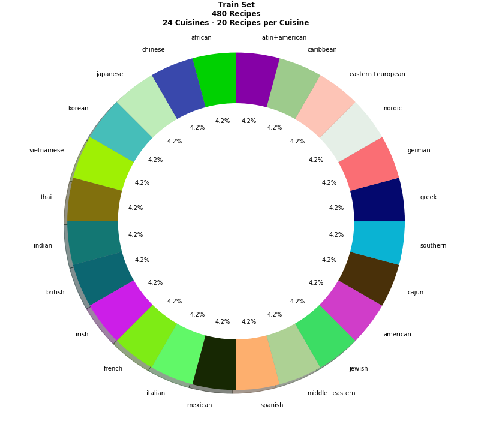
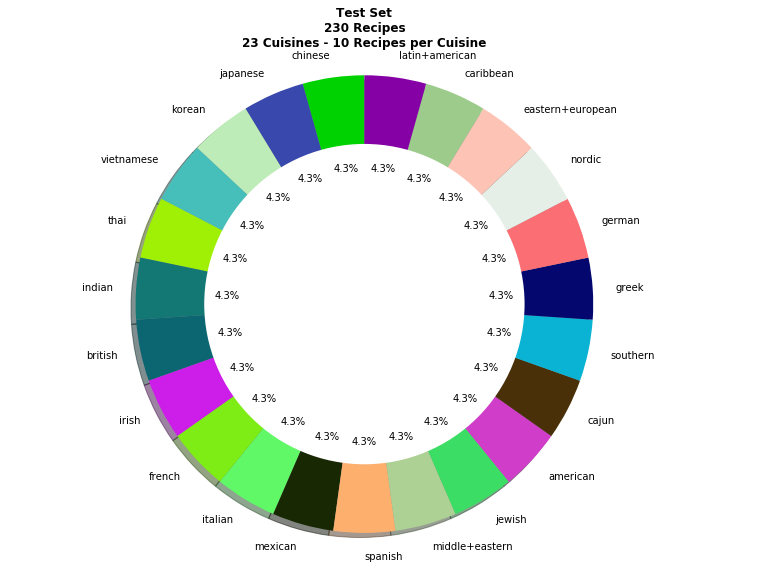
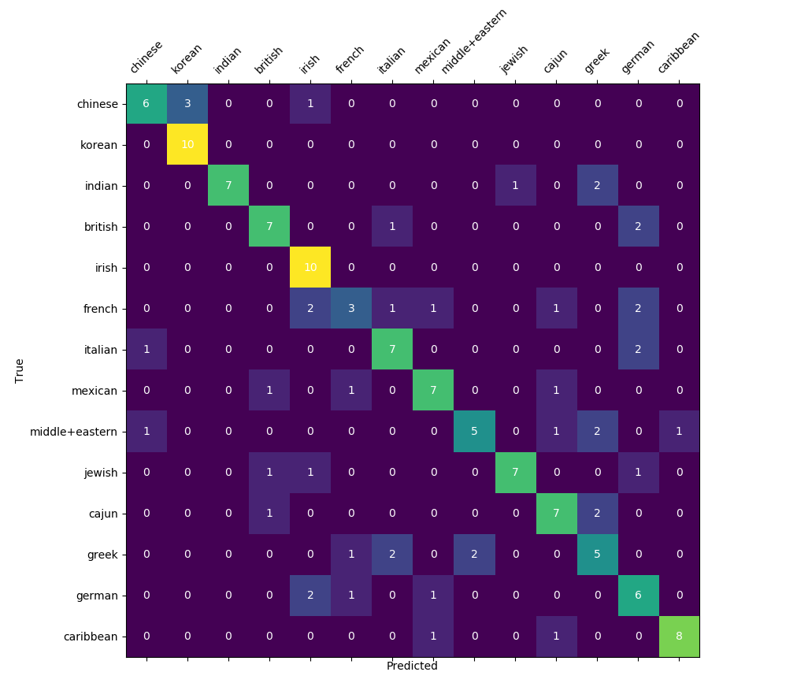
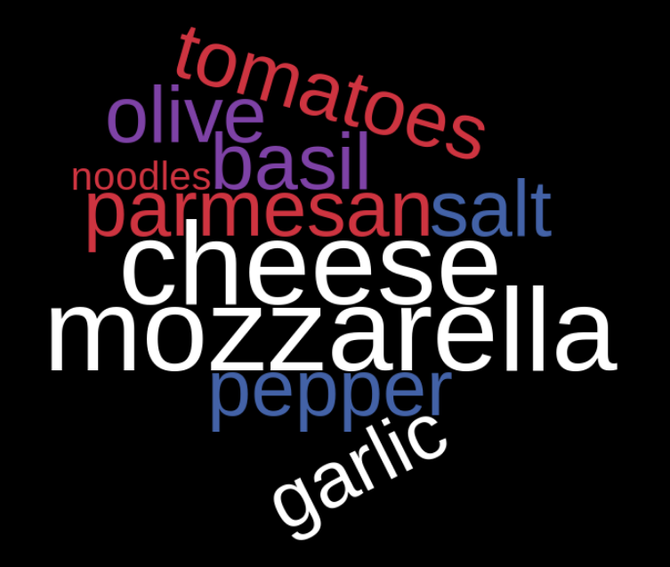
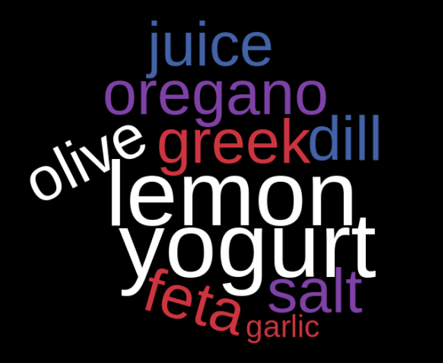
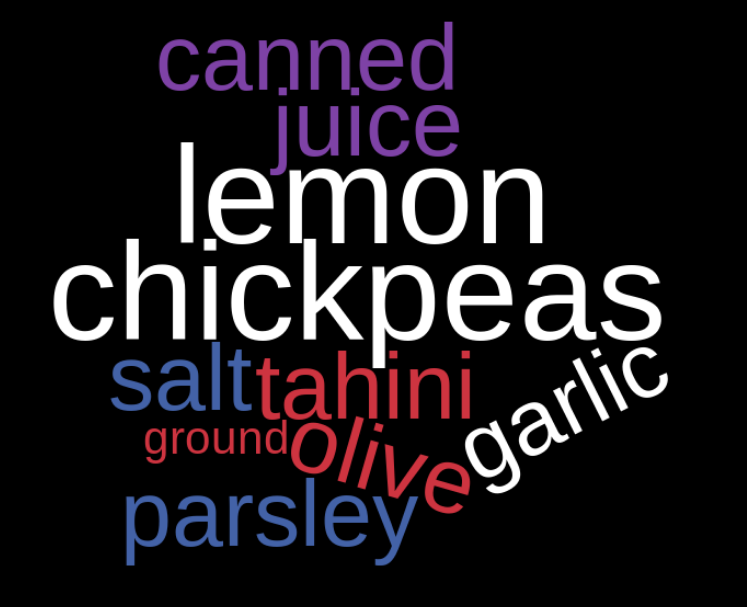

# Recipe Cuisine Classifier

I feel very confident that most are able to identify the cuisine of the dish below, without having to sink a fork in.




[Image Source](https://www.lanascooking.com/pasta-with-tomato-basil-sauce/)

What immediately makes you know that it is an Italian dish? The pasta? The fluffy pile of freshly grated Parmesan? Because you are able to recognize the ingredients by sight, the cuisine is not just identifiable, but obvious. Knowing that certain ingredients will be aligned with particular cuisines, can I build a classifier using NLP, bag-of-words and relating models to correctly classify a recipe's cuisine based on the ingredient list.


## Data

The recipe data was gathered using a food API. The API had functionality allowing parameters filters (one of them being cuisine) to be passed with the request. This gave me the ability to ensure my classes were evenly weighted:



When I requested the test recipes, I offset my results by 10 pages to avoid duplicating recipes from my train set in my test set. Unfortunately, there weren't enough African recipes in the entire data set to pull any of this cuisine 10 pages deep. My resulting test set:




Each recipe was a group of nested dictionaries, formatted as a string. The recipes could be easily navigated by converting the strings to Json objects. The ingredients were contained in an inner dictionary called, 'extendedIngredients'. Just to give an idea of the detail the ingredients lists contain, sample below:

```python  
>>> full_recipes_json_train[16]['extendedIngredients']

[{'id': 1022020,
  'aisle': 'Spices and Seasonings',
  'image': 'garlic-powder.png',
  'consitency': 'solid',
  'name': 'garlic powder',
  'original': '1 teaspoon garlic powder',
  'originalString': '1 teaspoon garlic powder',
  'originalName': 'garlic powder',
  'amount': 1.0,
  'unit': 'teaspoon',
  'meta': [],
  'metaInformation': [],
  'measures': {'us': {'amount': 1.0,
    'unitShort': 'tsp',
    'unitLong': 'teaspoon'},
   'metric': {'amount': 1.0, 'unitShort': 'tsp', 'unitLong': 'teaspoon'}}}, ... (the rest of the ingredients)]
   ```

After digging through a handful of recipes, I choose to use the ['name'] feature, which seemed to be the most generalized version of the ingredient.

## Feature Engineering

As you can see from the sample ingredient above, one ingredient can contain more than one word. Generating tokens of greater length than one, would actually create new ingredients instead of maintaining the integrity of the original ingredients. My first thought was to concatenate the individual ingredients and generate models using both the single word tokens and the concatenated ingredient tokens and compare. Results to follow.

## Naive Bayes Model

#### Base Models:

| Token Type        | Train Accuracy          | Test Accuracy  |
| ------------- |:-------------:| :-----:|
| Individual Words       | 91.25% | 45.22% |
| Concatenated Ingredients     | 98.33%      |   49.13% |

The model using concatenated ingredients preformed better, but not much better. Since the increase in performance was minimal, and concatenation makes the ingredients unable to stemmed or lemmatized, I chose to move forward with the Individual Words model for tuning.

#### Tuning Individual Words Model

| Tuning Update       | Train Accuracy          | Test Accuracy  |
| ------------- |:-------------:| :-----:|
| Individual Words - Base Model       | 91.25% | 45.22% |
| added stop_words = 'english'    | 91.67%      |   48.70% |
| added max_features = 300 (~ 480 originally)       | 86.67%      | 50.00%  |
| removed 10 cuisines (14 cuisines remain)             | 92.85%      | 63.57%  |
| added 280 new recipes (20 per cuisine) to train   | 87.68% | 67.86% |

```python
removed_cuisines = ['african', 'japanese', 'vietnamese', 'thai', 'spanish', 'american', 'southern', 'nordic', 'eastern+european', 'latin+american']
```

So what's getting incorrectly classified??

|Confusion Matrix - [14 cuisines, 560 train recipes (40 per), 140 test recipes, stop_words = 'english', max_features = 300]|
|:------------------------------:
||

Recipes in the Greek cuisine were incorrectly classified more than any other cuisine (5). Let's take a look at the top ten ingredients associated to the Greek cuisine and two of the cuisines it incorrectly identified as NOT Greek.

| Italian       | Greek          | Middle Eastern  |
| :-------------: |:-------------:| :-----:|
|       |  |  |

## Future Improvements
* Update API pipeline to make stored data easier to manipulate.
* Improve lemmatization process
 * noticed dependencies like "egg" and "eggs" both present in vocabulary
* Create process for mapping certain ingredients into a general category, while concatenating others
  * ex: "chicken breast" --> "chicken" | "smoked paprika" --> "smokedpaprika"
* With the two improvements above --> create corpus specific stop words
* more recipes
* Use LDA to see if the number of topics found in unsupervised learning match the number of cuisines in the data set
